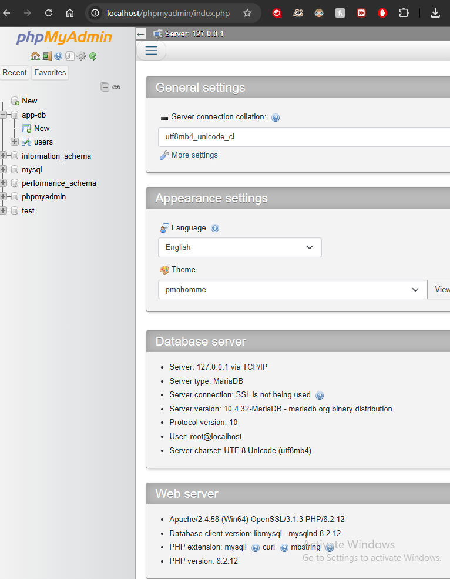
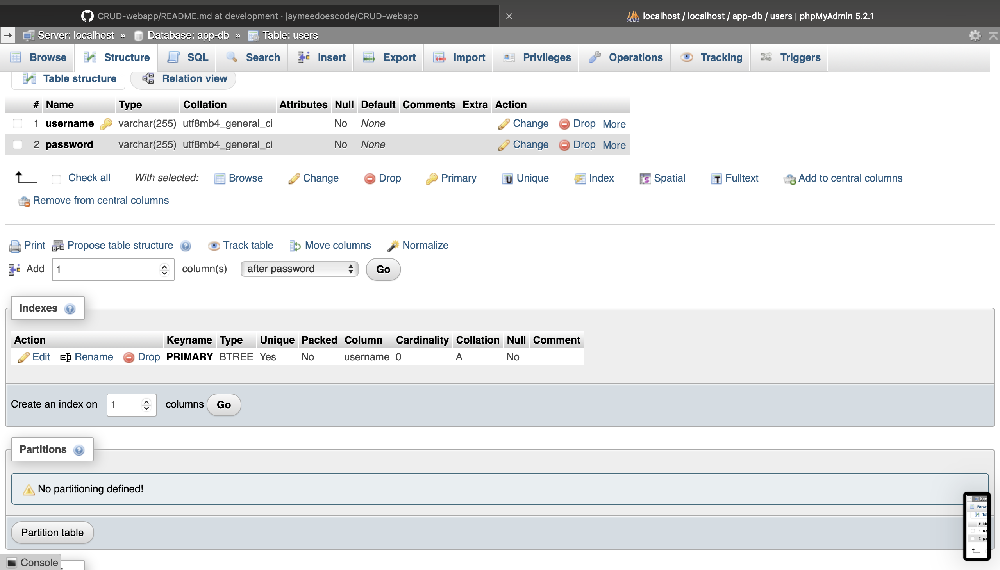
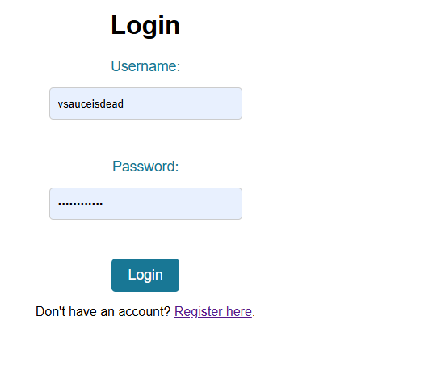
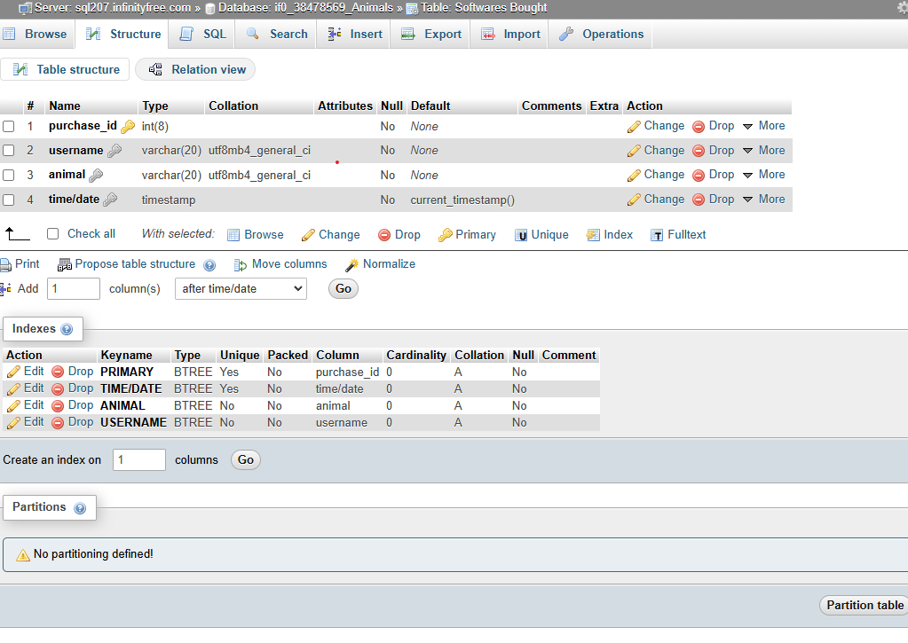
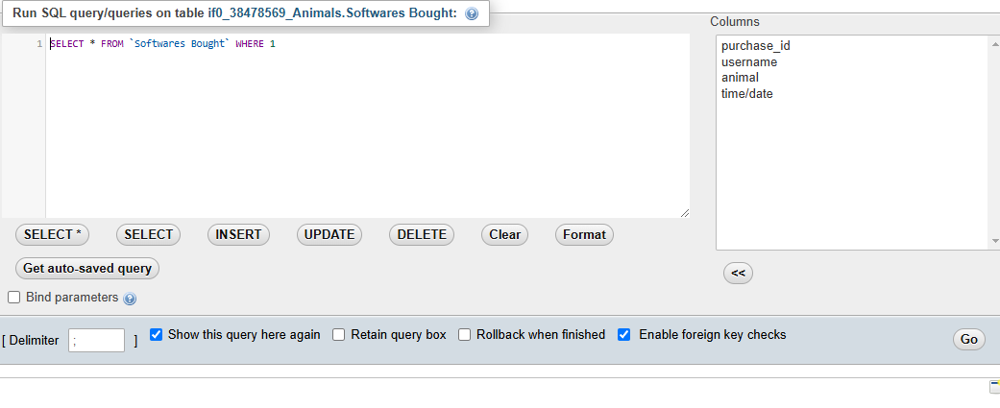
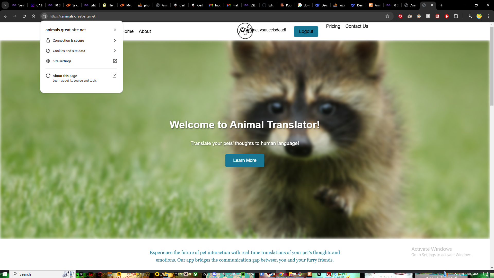
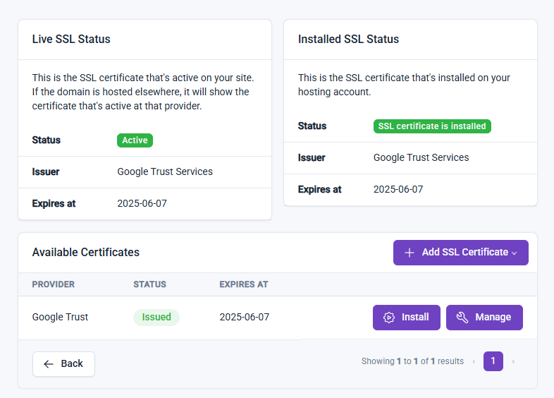
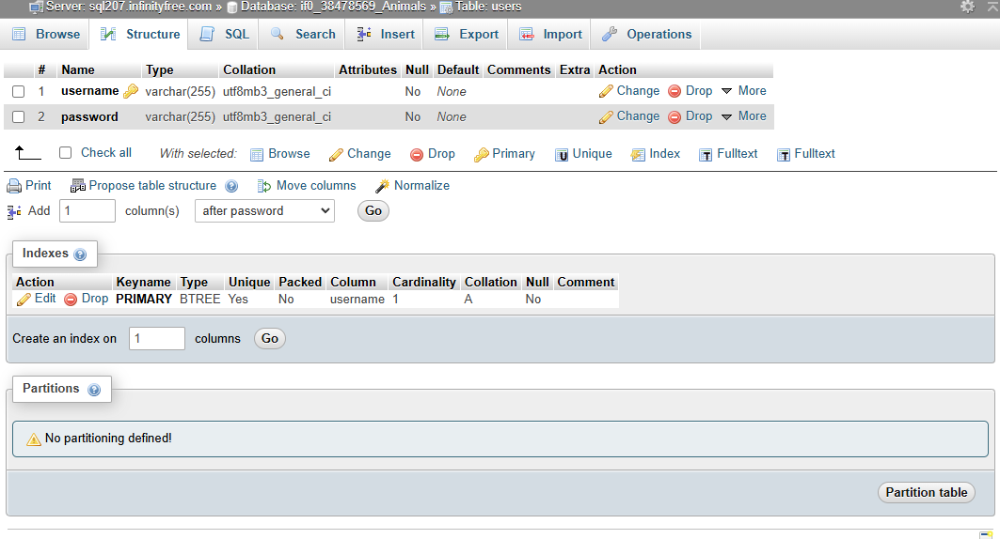

# Landing-Page-Animal-Translator
Animal translator software landing page for software dev assignment. Jaime and I made a project selling a machine that helps talk to animals. We split it down the middle so he got the index file and I got the about file, we split the small requirements and did styling for our own pages. We then collaborated at the end for testing, code review, and submitting. I, Abdu, had troubles with keeping accurate records of the commits and which branch I'm committing from which is definitely a lesson to be learned. I tried to leave small notes to try and make it less confusing. Overall, Jaime did a great job divvying up the workload and split it 50/50 so the work load was split even and we both got to work on the various parts so we'd have a better idea.

---

## Workflow Split


### Jaime’s Responsibilities:
- Create the GitHub repo & add the instructor/TAs.
- Build `index.html` (main landing page).
- Implement ID-based CSS styles & Flexbox.
- Test for mobile responsiveness.
- Review & approve Partner B’s pull request.

### Abdu’s Responsibilities:
- Define project details in the README file.
- Build `about.html` (or second page).
- Implement Class-based CSS styles & navigation styling.
- Run Google Lighthouse tests & optimize scores.
- Review & approve Partner A’s pull request.

### Both:
- Plan the project together.
- Set up GitHub issues & feature branches.
- Validate HTML/CSS & visually inspect site.
- Ensure GitHub Pages deployment is working.
- Confirm the 50/50 split in the README before submission.

---

###DEPLOYMENT URL:
[website deployment](animals.great-site.net)

# CRUD Web Application
Assignment 2 for software dev - Jaime & Abdu - A web application for user authentication and CRUD functionality using PHP and MySQL.

---

## Project Structure
- **css/** - CSS stylesheets
- **js/** - JavaScript files
- **php/** - PHP backend scripts (login, registration, CRUD)
- **sql/** - SQL scripts for database creation
- **images/** - Images and screenshots
- **README.md** - Project documentation and setup instructions

---

## Setup Instructions

### 1. **Install XAMPP:**
   - Download and install [XAMPP](https://www.apachefriends.org/index.html).
   - Start the Apache and MySQL services from the XAMPP Control Panel.

### 2. **Set Up the Database:**
   - Open phpMyAdmin by navigating to `http://localhost/phpmyadmin`.
   - Create a new database called `app-db` using the following SQL query:
     ```sql
     CREATE DATABASE `app-db`;
     ```
   - Create the `users` table using the following SQL query:
     ```sql
     CREATE TABLE `users` (
       `username` VARCHAR(255) NOT NULL,
       `password` VARCHAR(255) NOT NULL,
       PRIMARY KEY (`username`)
     );
     ```


### 3. **Clone the Repository:**
   - Clone this repository to your local machine:
     ```bash
     git clone https://github.com/your-username/your-repo-name.git
     ```
   - Move the project files to the `htdocs` folder in your XAMPP installation directory.

### 4. **Run the App:**
   - Open your browser and navigate to `http://localhost/your-project-folder`.

---

## Database Queries

### SQL Query to Create the Database:
```sql
CREATE DATABASE `app-db`;

SQL Query to Create the Users Table:


CREATE TABLE `users` (
  `username` VARCHAR(255) NOT NULL,
  `password` VARCHAR(255) NOT NULL,
  PRIMARY KEY (`username`)
);

```

## Screenshots

### 1. phpMyAdmin Interface


### 2. Users Table Structure


### 3. Login Page


### 4. Registration Page


### 5. Software Bought Structure


### 6. Software Bought SQL


### 7. SSL/TLS Certificate


### 8. SUPER SSL


### 9. Users Image



User Authentication and Session Management
Registration:

Users can register by providing a username and password.

Passwords are hashed and salted using PHP's password_hash() function before being stored in the database.

Duplicate usernames are not allowed.

Login:

Users can log in with their username and password.

Passwords are verified using PHP's password_verify() function.

Upon successful login, a session is started using session_start(), and the username is stored in $_SESSION['username'].

Logout:

Users can log out by destroying the session using session_destroy().

Session Management:

Users remain logged in across pages as long as the session is active.

Logged-in users are redirected away from the registration and login pages.

Final Testing
1. User Authentication Flow:
Registration:

Register a new user with a valid username and password.

Try registering with a duplicate username (should display: "Username already exists").

Try registering with mismatched passwords (should display: "Passwords do not match").

Try registering with a password shorter than 10 characters (should display: "Password must be at least 10 characters long").

Login:

Log in with a valid username and password.

Try logging in with an incorrect username or password (should display: "Invalid username or password").

Logout:

Log out and verify that the session is destroyed.

2. Session Management:
Verify that:

Logged-in users stay authenticated across pages.

Logged-in users cannot access the registration or login pages.

The username is displayed at the top of each page when logged in.

3. Collaborate with Partner B:
Ensure that the authentication module integrates seamlessly with Partner B’s CRUD functionality.

Test that:

Only the rightful owner can update or delete their entries.

All users can view data entered by others.

Deployment Instructions
1. Deploy to InfinityFree:
Sign up for a free account at InfinityFree.

Upload your project files to the InfinityFree server using FTP or their file manager.

Set up the database on InfinityFree using the same SQL queries provided above.

Production URL: http://animals.great-site.net

2. Set Up SSL/TLS Certificate:
Log in to your InfinityFree account and navigate to the Control Panel.

Click on "SSL/TLS" and follow the instructions to create and deploy a free SSL certificate.

Wait a few minutes for the certificate to activate. You should see a green padlock in the browser's address bar.

Verification Pictures (incomplete):
homework2pics/index.png
homework2pics/register.png
homework2pics/login.png
homework2pics/Certificate unfinished.png

Additional Checks
1. SQL Queries Are Parameterized:
All SQL queries use prepared statements to prevent SQL injection.

2. Passwords Are Hashed and Salted:
Passwords are hashed using password_hash() before being stored in the database.

3. Session Management Works:
Users stay logged in across pages.

Sessions are destroyed upon logout.

4. Logged-In Users Cannot Access Registration Page:
Logged-in users are redirected away from the registration page.

5. Error Messages Are Clear and User-Friendly:
All error messages (e.g., duplicate username, incorrect password) are clear and helpful.

## How to Use the Application

### User Registration and Authentication

1. **Register a New Account:**
   - Navigate to the registration page by clicking "Register" in the navigation menu
   - Enter a unique username
   - Create a password (minimum 10 characters)
   - Confirm your password
   - Click "Register" to create your account

2. **Login to Your Account:**
   - Navigate to the login page
   - Enter your username and password
   - Click "Login" to access your dashboard

3. **Logout:**
   - Click the "Logout" button in the navigation menu to end your session
  

## Database Structure and SQL Queries

### SQL Query to Create the Database:
```sql
CREATE DATABASE `app-db`;
```

### SQL Query to Create the Users Table:
```sql
CREATE TABLE `users` (
  `username` VARCHAR(255) NOT NULL,
  `password` VARCHAR(255) NOT NULL,
  PRIMARY KEY (`username`)
);
```

### SQL Query to Create the Purchases Table:
```sql
CREATE TABLE `purchases` (
  `purchase_id` int(8) NOT NULL AUTO_INCREMENT,
  `username` varchar(20) COLLATE utf8mb4_general_ci NOT NULL,
  `animal` varchar(20) COLLATE utf8mb4_general_ci NOT NULL,
  `time/date` timestamp NOT NULL DEFAULT current_timestamp(),
  PRIMARY KEY (`purchase_id`),
  KEY `TIME/DATE` (`time/date`),
  KEY `ANIMAL` (`animal`),
  KEY `USERNAME` (`username`)
) ENGINE=InnoDB DEFAULT CHARSET=utf8mb4 COLLATE=utf8mb4_general_ci;
```

Note: The `purchase_id` field uses MySQL's autoincrement (AI) feature to automatically assign a unique ID to each new purchase.

## How to Use the Application

### User Registration and Authentication

1. **Register a New Account:**
   - Navigate to the registration page by clicking "Register" in the navigation menu
   - Enter a unique username
   - Create a password (minimum 10 characters)
   - Confirm your password
   - Click "Register" to create your account

2. **Login to Your Account:**
   - Navigate to the login page
   - Enter your username and password
   - Click "Login" to access your dashboard

3. **Logout:**
   - Click the "Logout" button in the navigation menu to end your session

### CRUD Functionality for Animal Translator Software

1. **Create (Add New Software):**
   - From the dashboard, click on "Add New Software"
   - Fill out the required fields:
     - Software Name
     - Animal Type
     - Description
     - Price
   - Click "Save" to add the new software to the database

2. **Read (View Software):**
   - All available software will be displayed on the dashboard after login
   - You can see software added by all users, including details like name, animal type, and price
   - Click on any software name to view more details

3. **Update (Edit Software):**
   - To edit software that you've added:
     - Find the software in the list
     - Click the "Edit" button next to your software entry
     - Update the information in the form that appears
     - Click "Save Changes" to update the database
   - Note: You can only edit software that you've added, not software added by other users

4. **Delete (Remove Software):**
   - To delete software that you've added:
     - Find the software in the list
     - Click the "Delete" button next to your software entry
     - Confirm deletion when prompted
   - Note: You can only delete software that you've added, not software added by other users

### Tips for Using the Application

- All fields are required when adding or editing software
- Price must be entered as a numeric value
- Your username will be displayed at the top of each page when logged in
- You'll see all software entries from all users, but can only modify your own

### CRUD Functionality for Animal Translator Software

1. **Create (Add New Software):**
   - From the dashboard, click on "Add New Software"
   - Fill out the required fields:
     - Software Name
     - Animal Type
     - Description
     - Price
   - Click "Save" to add the new software to the database

2. **Read (View Software):**
   - All available software will be displayed on the dashboard after login
   - You can see software added by all users, including details like name, animal type, and price
   - Click on any software name to view more details

3. **Update (Edit Software):**
   - To edit software that you've added:
     - Find the software in the list
     - Click the "Edit" button next to your software entry
     - Update the information in the form that appears
     - Click "Save Changes" to update the database
   - Note: You can only edit software that you've added, not software added by other users

4. **Delete (Remove Software):**
   - To delete software that you've added:
     - Find the software in the list
     - Click the "Delete" button next to your software entry
     - Confirm deletion when prompted
   - Note: You can only delete software that you've added, not software added by other users

### Tips for Using the Application

- All fields are required when adding or editing software
- Price must be entered as a numeric value
- Your username will be displayed at the top of each page when logged in
- You'll see all software entries from all users, but can only modify your own

Contribution
Jaime: 50%

Abdu: 50%

# 📱 Assignment 3: Animal Translator App (Mobile + Backend)

This app allows users to log in and view their "animal translations" using a locally hosted backend and a mobile frontend built in React Native. This README describes exactly how to test the system locally using XAMPP and Expo.

---

##  Setup Instructions (Local)

 1. Install Required Tools
-  [XAMPP](https://www.apachefriends.org/) (for PHP + MySQL backend)
-  [Node.js](https://nodejs.org/) (includes npm)
-  [Expo CLI](https://docs.expo.dev/get-started/installation/)

Install Expo CLI:
bash
npm install -g expo-cli

2. Set Up Backend

    Copy the rest-api/ folder into this location:

    C:\xampp\htdocs\test\rest-api

    Start Apache and MySQL in XAMPP

    Go to http://localhost/phpmyadmin and run:

CREATE DATABASE at-test;

CREATE TABLE animals (
  purchase_id INT PRIMARY KEY AUTO_INCREMENT,
  username VARCHAR(20),
  animal VARCHAR(20),
  translation VARCHAR(100),
  time_date TIMESTAMP DEFAULT CURRENT_TIMESTAMP
);

CREATE TABLE users (
  username VARCHAR(20) PRIMARY KEY,
  password VARCHAR(255)
);

    Update this file:

rest-api/inc/config.php

define("DB_HOST", "localhost");
define("DB_USERNAME", "root");
define("DB_PASSWORD", "");
define("DB_DATABASE_NAME", "at-test");

    Confirm it's working: Visit in your browser:

http://localhost/test/rest-api/api.php?endpoint=animal&action=read

It should return [] or valid JSON.

3. Set Up React Native App

    Navigate to the frontend folder:

cd animal-translator-app

    Install dependencies:

npm install

    Start the app:

npx expo start

⚠️ IMPORTANT: Set Correct IP Address

You must replace localhost with your local IP address so the app can access the backend.

    Run this in Command Prompt to find your IP:

ipconfig

Look for your IPv4 Address (e.g., 192.168.1.20)

    Open:

animal-translator-app/api/animalApi.ts

Update this line:

const BASE_URL = "http://192.168.1.20/test/rest-api/api.php";

 Save and restart the app. Your mobile frontend should now talk to the local PHP backend.
 What to Test

    Tap "Add Animal" → fill in animal + translation → tap submit

    App should redirect to home screen and show the new animal in the list

    Backend data will appear in phpMyAdmin under the animals table


Screenshots to Include 

📱 Add Animal screen


📱 Home screen showing animal list


🧪 Postman testing your GET and POST endpoints


🗃️ phpMyAdmin table of animals


🔧 config file or localhost URL showing success


########################################################################################

Assignment 4 Information !

### Part 1 – PHPUnit API Tests  
**What we did:**  
- Added **four core tests** for `register_api_get.php`, `login_api_get.php` (success/failure), and `getPurchase_api.php` in `tests/ApiTest.php`.  
- Each test uses **Guzzle** to issue HTTP GETs against `http://localhost/animal-translator/`, then asserts status codes and JSON fields.  
- Ensured tests are **idempotent** by generating fresh usernames with `uniqid()` so re-runs never collide.

### PHPUnit Test Results

Below is the console output from `vendor/bin/phpunit --colors`, showing all four core tests (and the AI‑assisted edge case) running green:


##Describe your workflow, e.g.:

##Problem 2: AI-Assisted Testing
To explore generative AI in testing, I prompted ChatGPT with:
“Write a PHPUnit test method named testMakePurchaseMissingUsername in PHP. Assume this is inside a TestCase class with a pre-configured GuzzleHttp\Client in $this->client (base_uri “http://localhost/animal-translator/”, http_errors=false). The method should:
Send a GET to makePurchase_api.php with only animal=Cat.
Assert status code 200.
Decode JSON.
Assert success is false.
Assert the message mentions that username is required.
I then copied ChatGPT’s stub, tweaked the assertions to match my API’s behavior, and placed it in tests/PurchaseApiTest.php. Running
bash
CopyEdit
vendor/bin/phpunit tests/PurchaseApiTest.php --colors
yielded a green test, demonstrating that the AI-generated test correctly caught the missing-username error.

### Part 2 – AI-Assisted Edge-Case Test  
**What we did:**  
- Crafted a **ChatGPT prompt** to generate an edge-case test for `makePurchase_api.php` when `username` is missing.  
- Prompt:
   > “Write a PHPUnit test method named `testMakePurchaseMissingUsername` in PHP.  
   > Assume a TestCase with `$this->client` pointing at `http://localhost/animal-translator/`.  
   > The method should GET `makePurchase_api.php?animal=Cat`, assert HTTP 200, decode JSON, assert `success:false`, and that `message` mentions “username.””  
- Copied the AI’s stub into `tests/PurchaseApiTest.php`, tweaked it to match our actual endpoint behavior, and confirmed it passes.

**How to reproduce:**  
```bash
vendor/bin/phpunit tests/PurchaseApiTest.php --colors
```

**How to run:**  
1. Install PHP & Composer (e.g. via Homebrew or XAMPP’s PHP CLI).  
2. In your API root (`…/htdocs/animal-translator`):  
   ```bash
   composer install
   vendor/bin/phpunit --colors
   ```


### Part 3 – UI & UX Enhancements (“Animal Talk” Edition)  
**Core polish (Project 4 UI tasks):**  
1. **Search & Sort** on the purchases list (text filter + newest/oldest toggle).  
2. **Styling** via React Native Paper, matching your website’s theme (logo, cards, inputs, buttons).  
3. **Interactive Gestures**: swipe-to-edit and swipe-to-refund with `react-native-gesture-handler`.  
4. **Feedback UX**:  
   - Loading spinner on list load  
   - Empty-state message  
   - Toast/snackbar and confetti on successful purchase  
5. **Responsive layouts** using Flexbox + ScrollView/FlatList.  
6. **Accessibility**: proper labels, button roles, high-contrast text.  

**Creative “Animal Talk” feature:**  
- Added a **“Talk Now”** button on each purchase card.  
- Built `AnimalTalkScreen.js` that lets you **hold to “record”**, shows **“Translating…”**, then switches to a **“Here’s what your {animal} is saying!”** view while playing back a canned `.m4a` clip.  
- Used **expo-av** for zero-linking audio playback of `dog.m4a`, `cat.m4a`, etc.  
- Wrote a dropdown to pick your animal (instead of free text) and a confetti animation on purchase.

**How to run the frontend:**  
```bash
cd frontend-app
npm install
# If you’re on RN bare: 
#   npx pod-install ios
npx expo start --clear
# then press “a” to open on Android, or scan the QR in Expo Go
```

---
##Locally running with SQL database schema set up!


### 1. Create the `Animals` database

Open phpMyAdmin at `http://localhost/phpmyadmin` (or your preferred MySQL client) and run this SQL to create the schema and tables:

```sql
-- 1. Create the database
CREATE DATABASE IF NOT EXISTS `Animals`
  CHARACTER SET utf8mb4
  COLLATE utf8mb4_general_ci;
USE `Animals`;

-- 2. Create the 'users' table
CREATE TABLE `users` (
  `username`   VARCHAR(255)     NOT NULL,
  `password`   VARCHAR(255)     NOT NULL,
  PRIMARY KEY (`username`)
) ENGINE=InnoDB
  DEFAULT CHARSET=utf8mb4
  COLLATE=utf8mb4_general_ci;

-- 3. Create the 'animals' table
CREATE TABLE `animals` (
  `purchase_id` INT(8)          NOT NULL AUTO_INCREMENT,
  `username`    VARCHAR(20)     NOT NULL,
  `animal`      VARCHAR(20)     NOT NULL,
  `time_date`   TIMESTAMP       NOT NULL DEFAULT CURRENT_TIMESTAMP,
  PRIMARY KEY (`purchase_id`),
  INDEX `idx_username` (`username`)
) ENGINE=InnoDB
  DEFAULT CHARSET=utf8mb4
  COLLATE=utf8mb4_general_ci;
```

### 2. Configure PHP & Composer

You can run PHP and Composer either via XAMPP’s bundled binaries or a system install. Here’s the XAMPP approach:

```bash
# 1. Change into your API folder
cd "/Applications/XAMPP/xamppfiles/htdocs/animal-translator"

# 2. (If you haven't) download Composer installer
curl -sS https://getcomposer.org/installer -o composer-setup.php

# 3. Run installer with XAMPP’s PHP
/Applications/XAMPP/xamppfiles/bin/php composer-setup.php

# 4. Install PHPUnit & Guzzle
/Applications/XAMPP/xamppfiles/bin/php composer.phar require --dev phpunit/phpunit:^9 guzzlehttp/guzzle:^7
```

> **Tip:** If you prefer a system PHP, you can instead `brew install php composer` and then just run `composer require …` inside your project root.

### 3. Set up your PHP connection

In `conn.php`, point the host at TCP to avoid socket issues:

```php
<?php
$db_host = '127.0.0.1';
$db_user = 'root';
$db_pass = '';
$db_name = 'Animals';

$mysqli = new mysqli($db_host, $db_user, $db_pass, $db_name);
if ($mysqli->connect_error) {
  die('DB Connect Error (' . $mysqli->connect_errno . ') ' . $mysqli->connect_error);
}
?>
```

### 4. Run your PHPUnit tests

From the same `animal-translator` folder:

```bash
# Core tests (Part 1)
vendor/bin/phpunit --colors

# AI‐assisted edge‐case (Part 2)
vendor/bin/phpunit tests/PurchaseApiTest.php --colors
```

You should see:

```
OK (4 tests, 11 assertions)
OK (1 test, 5 assertions)
```

### 5. Start the React Native frontend

In a separate terminal, navigate to your Expo app and launch:

```bash
cd "/Applications/XAMPP/xamppfiles/htdocs/animal-translator/frontend-app"
npm install
npx expo start --clear
# Press 'a' to open on Android, or scan the QR with Expo Go
```

Your mobile app will now point at `http://localhost/animal-translator/` for all CRUD and “Animal Talk” audio features.

---

---

## Running Everything Locally (XAMPP + Expo)

1. **Clone or copy** this repo into your XAMPP `htdocs`:  
   ```
   /Applications/XAMPP/xamppfiles/htdocs/animal-translator
   ```
   **IMPORTANT:
   The animal-translator/ directory (contains all PHP API endpoints, database connection (conn.php), and PHPUnit tests) must be placed in XAMPP’s htdocs          (e.g. /Applications/XAMPP/xamppfiles/htdocs/animal-translator).

   All React Native UI code lives in the frontend-app/ folder. Do not include animal-translator/ in your GitHub repo when running the mobile app—keep that       folder deployed under XAMPP’s htdocs only.
2. **Start XAMPP**’s Apache & MySQL via the XAMPP Control Panel.
3. **Create the database** (`Animals`):  
   - Open phpMyAdmin at `http://localhost/phpmyadmin`  
   - Create a new schema named `Animals` and import any provided SQL seed.
4. **Adjust `conn.php`** (already set in repo) to use:
   ```php
   $db_host = '127.0.0.1';
   $db_user = 'root';
   $db_pass = '';
   $db_name = 'Animals';
   ```
5. **Install PHP dependencies**:  
   ```bash
   cd /Applications/XAMPP/xamppfiles/htdocs/animal-translator
   composer install
   ```
6. **Run your PHPUnit tests**:
   ```bash
   vendor/bin/phpunit --colors
   ```
7. **Start the mobile app** (in a separate terminal):
   ```bash
   cd /Applications/XAMPP/xamppfiles/htdocs/animal-translator/frontend-app
   npm install
   npx expo start --clear
   ```
   - Press **a** to launch on Android or scan the QR with Expo Go.


Android studio was used alongside a 34 APK Pixel 6A android emulator for testing purposes.

##Images:


Purchases Screen — Features

Logout button in the header
Welcome greeting with username
Search bar (filter by animal name)
Sort toggle (Newest ↕︎ / Oldest ↕︎)
Swipe‑to‑Edit (pencil icon)
Swipe‑to‑Refund (undo icon)
“Talk Now” button on each card (hold‑to‑record UI, “Translating…” state, audio playback)
Floating “+” FAB to buy a new animal


Animal Talk Screen:


PhpMyAdmin local database:


Login Screen:


Register Screen: 


Make Purchase Screen: 


Successful Purchase (hooray!):
(I'm actually not fast enough to get a picture of this but a popup comes up that says "You have succesfully made a purchase! and confetti fills the screen)

Refund and edit options (Swipable):


Refund:


Edit: 


 
Abdu and Jaime - We split the work flow exactly 50/50 this project!


## Credits
- Frontend: Jaime 50%
- Backend: Abdu 50%

