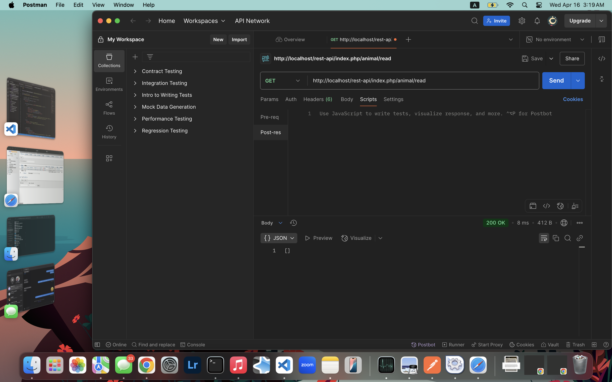
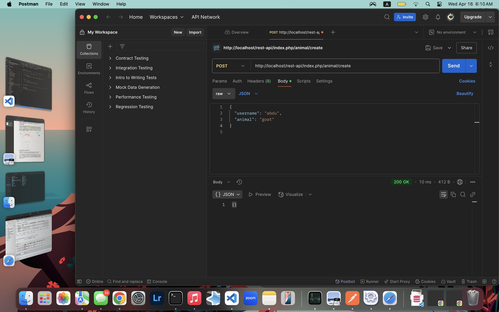

# Landing-Page-Animal-Translator
Animal translator software landing page for software dev assignment. Jaime and I made a project selling a machine that helps talk to animals. We split it down the middle so he got the index file and I got the about file, we split the small requirements and did styling for our own pages. We then collaborated at the end for testing, code review, and submitting. I, Abdu, had troubles with keeping accurate records of the commits and which branch I'm committing from which is definitely a lesson to be learned. I tried to leave small notes to try and make it less confusing. Overall, Jaime did a great job divvying up the workload and split it 50/50 so the work load was split even and we both got to work on the various parts so we'd have a better idea.

---

## Workflow Split


### Jaime’s Responsibilities:
- Create the GitHub repo & add the instructor/TAs.
- Build `index.html` (main landing page).
- Implement ID-based CSS styles & Flexbox.
- Test for mobile responsiveness.
- Review & approve Partner B’s pull request.

### Abdu’s Responsibilities:
- Define project details in the README file.
- Build `about.html` (or second page).
- Implement Class-based CSS styles & navigation styling.
- Run Google Lighthouse tests & optimize scores.
- Review & approve Partner A’s pull request.

### Both:
- Plan the project together.
- Set up GitHub issues & feature branches.
- Validate HTML/CSS & visually inspect site.
- Ensure GitHub Pages deployment is working.
- Confirm the 50/50 split in the README before submission.

---

###DEPLOYMENT URL:
[website deployment](animals.great-site.net)

# CRUD Web Application
Assignment 2 for software dev - Jaime & Abdu - A web application for user authentication and CRUD functionality using PHP and MySQL.

---

## Project Structure
- **css/** - CSS stylesheets
- **js/** - JavaScript files
- **php/** - PHP backend scripts (login, registration, CRUD)
- **sql/** - SQL scripts for database creation
- **images/** - Images and screenshots
- **README.md** - Project documentation and setup instructions

---

## Setup Instructions

### 1. **Install XAMPP:**
   - Download and install [XAMPP](https://www.apachefriends.org/index.html).
   - Start the Apache and MySQL services from the XAMPP Control Panel.

### 2. **Set Up the Database:**
   - Open phpMyAdmin by navigating to `http://localhost/phpmyadmin`.
   - Create a new database called `app-db` using the following SQL query:
     ```sql
     CREATE DATABASE `app-db`;
     ```
   - Create the `users` table using the following SQL query:
     ```sql
     CREATE TABLE `users` (
       `username` VARCHAR(255) NOT NULL,
       `password` VARCHAR(255) NOT NULL,
       PRIMARY KEY (`username`)
     );
     ```


### 3. **Clone the Repository:**
   - Clone this repository to your local machine:
     ```bash
     git clone https://github.com/your-username/your-repo-name.git
     ```
   - Move the project files to the `htdocs` folder in your XAMPP installation directory.

### 4. **Run the App:**
   - Open your browser and navigate to `http://localhost/your-project-folder`.

---

## Database Queries

### SQL Query to Create the Database:
```sql
CREATE DATABASE `app-db`;

SQL Query to Create the Users Table:


CREATE TABLE `users` (
  `username` VARCHAR(255) NOT NULL,
  `password` VARCHAR(255) NOT NULL,
  PRIMARY KEY (`username`)
);

```

## Screenshots

### 1. phpMyAdmin Interface


### 2. Users Table Structure


### 3. Login Page


### 4. Registration Page


### 5. Software Bought Structure


### 6. Software Bought SQL


### 7. SSL/TLS Certificate


### 8. SUPER SSL


### 9. Users Image


User Authentication and Session Management
Registration:

Users can register by providing a username and password.

Passwords are hashed and salted using PHP's password_hash() function before being stored in the database.

Duplicate usernames are not allowed.

Login:

Users can log in with their username and password.

Passwords are verified using PHP's password_verify() function.

Upon successful login, a session is started using session_start(), and the username is stored in $_SESSION['username'].

Logout:

Users can log out by destroying the session using session_destroy().

Session Management:

Users remain logged in across pages as long as the session is active.

Logged-in users are redirected away from the registration and login pages.

Final Testing
1. User Authentication Flow:
Registration:

Register a new user with a valid username and password.

Try registering with a duplicate username (should display: "Username already exists").

Try registering with mismatched passwords (should display: "Passwords do not match").

Try registering with a password shorter than 10 characters (should display: "Password must be at least 10 characters long").

Login:

Log in with a valid username and password.

Try logging in with an incorrect username or password (should display: "Invalid username or password").

Logout:

Log out and verify that the session is destroyed.

2. Session Management:
Verify that:

Logged-in users stay authenticated across pages.

Logged-in users cannot access the registration or login pages.

The username is displayed at the top of each page when logged in.

3. Collaborate with Partner B:
Ensure that the authentication module integrates seamlessly with Partner B’s CRUD functionality.

Test that:

Only the rightful owner can update or delete their entries.

All users can view data entered by others.

Deployment Instructions
1. Deploy to InfinityFree:
Sign up for a free account at InfinityFree.

Upload your project files to the InfinityFree server using FTP or their file manager.

Set up the database on InfinityFree using the same SQL queries provided above.

Production URL: http://animals.great-site.net

2. Set Up SSL/TLS Certificate:
Log in to your InfinityFree account and navigate to the Control Panel.

Click on "SSL/TLS" and follow the instructions to create and deploy a free SSL certificate.

Wait a few minutes for the certificate to activate. You should see a green padlock in the browser's address bar.

Verification Pictures (incomplete):
homework2pics/index.png
homework2pics/register.png
homework2pics/login.png
homework2pics/Certificate unfinished.png

Additional Checks
1. SQL Queries Are Parameterized:
All SQL queries use prepared statements to prevent SQL injection.

2. Passwords Are Hashed and Salted:
Passwords are hashed using password_hash() before being stored in the database.

3. Session Management Works:
Users stay logged in across pages.

Sessions are destroyed upon logout.

4. Logged-In Users Cannot Access Registration Page:
Logged-in users are redirected away from the registration page.

5. Error Messages Are Clear and User-Friendly:
All error messages (e.g., duplicate username, incorrect password) are clear and helpful.

## How to Use the Application

### User Registration and Authentication

1. **Register a New Account:**
   - Navigate to the registration page by clicking "Register" in the navigation menu
   - Enter a unique username
   - Create a password (minimum 10 characters)
   - Confirm your password
   - Click "Register" to create your account

2. **Login to Your Account:**
   - Navigate to the login page
   - Enter your username and password
   - Click "Login" to access your dashboard

3. **Logout:**
   - Click the "Logout" button in the navigation menu to end your session
  

## Database Structure and SQL Queries

### SQL Query to Create the Database:
```sql
CREATE DATABASE `app-db`;
```

### SQL Query to Create the Users Table:
```sql
CREATE TABLE `users` (
  `username` VARCHAR(255) NOT NULL,
  `password` VARCHAR(255) NOT NULL,
  PRIMARY KEY (`username`)
);
```

### SQL Query to Create the Purchases Table:
```sql
CREATE TABLE `purchases` (
  `purchase_id` int(8) NOT NULL AUTO_INCREMENT,
  `username` varchar(20) COLLATE utf8mb4_general_ci NOT NULL,
  `animal` varchar(20) COLLATE utf8mb4_general_ci NOT NULL,
  `time_date` timestamp NOT NULL DEFAULT current_timestamp(),
  PRIMARY KEY (`purchase_id`),
  KEY `TIME_DATE` (`time_date`),
  KEY `ANIMAL` (`animal`),
  KEY `USERNAME` (`username`)
) ENGINE=InnoDB DEFAULT CHARSET=utf8mb4 COLLATE=utf8mb4_general_ci;
```

Note: The `purchase_id` field uses MySQL's autoincrement (AI) feature to automatically assign a unique ID to each new purchase.

## How to Use the Application

### User Registration and Authentication

1. **Register a New Account:**
   - Navigate to the registration page by clicking "Register" in the navigation menu
   - Enter a unique username
   - Create a password (minimum 10 characters)
   - Confirm your password
   - Click "Register" to create your account

2. **Login to Your Account:**
   - Navigate to the login page
   - Enter your username and password
   - Click "Login" to access your dashboard

3. **Logout:**
   - Click the "Logout" button in the navigation menu to end your session

### CRUD Functionality for Animal Translator Software

1. **Create (Add New Software):**
   - From the dashboard, click on "Add New Software"
   - Fill out the required fields:
     - Software Name
     - Animal Type
     - Description
     - Price
   - Click "Save" to add the new software to the database

2. **Read (View Software):**
   - All available software will be displayed on the dashboard after login
   - You can see software added by all users, including details like name, animal type, and price
   - Click on any software name to view more details

3. **Update (Edit Software):**
   - To edit software that you've added:
     - Find the software in the list
     - Click the "Edit" button next to your software entry
     - Update the information in the form that appears
     - Click "Save Changes" to update the database
   - Note: You can only edit software that you've added, not software added by other users

4. **Delete (Remove Software):**
   - To delete software that you've added:
     - Find the software in the list
     - Click the "Delete" button next to your software entry
     - Confirm deletion when prompted
   - Note: You can only delete software that you've added, not software added by other users

### Tips for Using the Application

- All fields are required when adding or editing software
- Price must be entered as a numeric value
- Your username will be displayed at the top of each page when logged in
- You'll see all software entries from all users, but can only modify your own

### CRUD Functionality for Animal Translator Software

1. **Create (Add New Software):**
   - From the dashboard, click on "Add New Software"
   - Fill out the required fields:
     - Software Name
     - Animal Type
     - Description
     - Price
   - Click "Save" to add the new software to the database

2. **Read (View Software):**
   - All available software will be displayed on the dashboard after login
   - You can see software added by all users, including details like name, animal type, and price
   - Click on any software name to view more details

3. **Update (Edit Software):**
   - To edit software that you've added:
     - Find the software in the list
     - Click the "Edit" button next to your software entry
     - Update the information in the form that appears
     - Click "Save Changes" to update the database
   - Note: You can only edit software that you've added, not software added by other users

4. **Delete (Remove Software):**
   - To delete software that you've added:
     - Find the software in the list
     - Click the "Delete" button next to your software entry
     - Confirm deletion when prompted
   - Note: You can only delete software that you've added, not software added by other users

### Tips for Using the Application

- All fields are required when adding or editing software
- Price must be entered as a numeric value
- Your username will be displayed at the top of each page when logged in
- You'll see all software entries from all users, but can only modify your own

Contribution
Jaime: 50%

Abdu: 50%

# Animal Translator App

## Overview
Welcome to the Animal Translator App! This is a React Native app built for a class project. The app allows users to log in, register, and view animal translations. It connects to a backend server for user authentication and animal translation data.

This repository contains both the frontend (React Native) and backend (PHP) components, with the frontend being handled by me, [Your Name], and the backend by my partner, [Partner's Name].

## How to Run the Frontend

### Prerequisites
Before you can run the app locally, make sure you have the following installed:
- **Node.js** (includes npm) - Download from [Node.js](https://nodejs.org/)
- **Expo CLI** - Install using npm:
  ```bash
  npm install -g expo-cli
  ```

### Running Locally
1. **Clone the Repository**: Clone this repository to your local machine:
   ```bash
   git clone https://github.com/jaymeedoescode/Landing-Page-Animal-Translator.git
   cd animal-translator-app
   ```

2. **Install Dependencies**: Run this command to install the project dependencies:
   ```bash
   npm install
   ```

3. **Start the Project**: Launch the development server:
   ```bash
   npm start
   ```
   This will open Expo DevTools in your browser.
   You can either:
   - Scan the QR code with Expo Go on your phone (available on both Android and iOS).
   - Or press 'a' to launch the app in an Android emulator (make sure the emulator is running).

### Change the IP Address
Since the app connects to a backend server, you need to update the IP address used for API requests.

1. **Locate the IP Address in the Code**: In HomeScreen.tsx, LoginScreen.tsx, and other files where API calls are made, find this line:
   ```javascript
   fetch("http://<YOUR-IP>/login.php")
   ```

2. **Update the IP Address**: Replace `<YOUR-IP>` with your local machine's IP address (e.g., http://192.168.x.x).
   - For Windows: Run `ipconfig` in Command Prompt to find your IPv4 address.
   - For macOS/Linux: Use `ifconfig` to find your local IP.

3. **Test It**: After updating the IP address in the code, restart your Expo project. The app should now connect to your backend server.


## Backend Setup and Configuration

### Security Best Practices

1. **Environment Variables**: Never store sensitive information (like database credentials) directly in your code.
   - Create a `.env` file to store sensitive information
   - Add this file to your `.gitignore` to ensure it's not committed to version control
   - Example `.env` file:
     ```
     DB_HOST=your_database_host
     DB_USERNAME=your_database_username
     DB_PASSWORD=your_database_password
     DB_NAME=your_database_name
     ```

2. **Create a sample environment file**:
   - Provide a `.env.example` file with placeholder values
   - Example:
     ```
     DB_HOST=localhost
     DB_USERNAME=db_user
     DB_PASSWORD=your_password_here
     DB_NAME=animal_translator
     ```

3. **Update config.php to use environment variables**:
   ```php
   <?php
   // Load environment variables from .env file (using a library like phpdotenv)
   
   define("DB_HOST", getenv('DB_HOST'));
   define("DB_USERNAME", getenv('DB_USERNAME'));
   define("DB_PASSWORD", getenv('DB_PASSWORD')); 
   define("DB_DATABASE_NAME", getenv('DB_NAME'));
   ```

### Error Handling and Debugging

Common backend issues and their solutions:

1. **Database Connection Errors**
   - Check that your `.env` file exists and contains the correct credentials
   - Verify that your database server is running and accessible from your hosting environment
   - Some hosting providers (like InfinityFree) may restrict database access to their own servers

2. **SQL Query Issues**
   - Always use prepared statements to prevent SQL injection (your code already does this)
   - Fixed incorrect SQL in the update method:
     ```php
     // Correct syntax
     $sql = "UPDATE animals SET animal = ? WHERE purchase_id = ?";
     ```

3. **File Path Issues**
   - Ensure all file paths are correct in your `require` statements
   - Use absolute paths with the `PROJECT_ROOT_PATH` constant

### API Endpoint Structure
The backend API follows RESTful conventions:
- `/api/animal/read` - Get all animals
- `/api/user/list` - Get all users
- `/api/user/create` - Add a new user/animal translation

Postman approval get:





## Credits
- Frontend: Jaime 50%
- Backend: Abdu 50%

